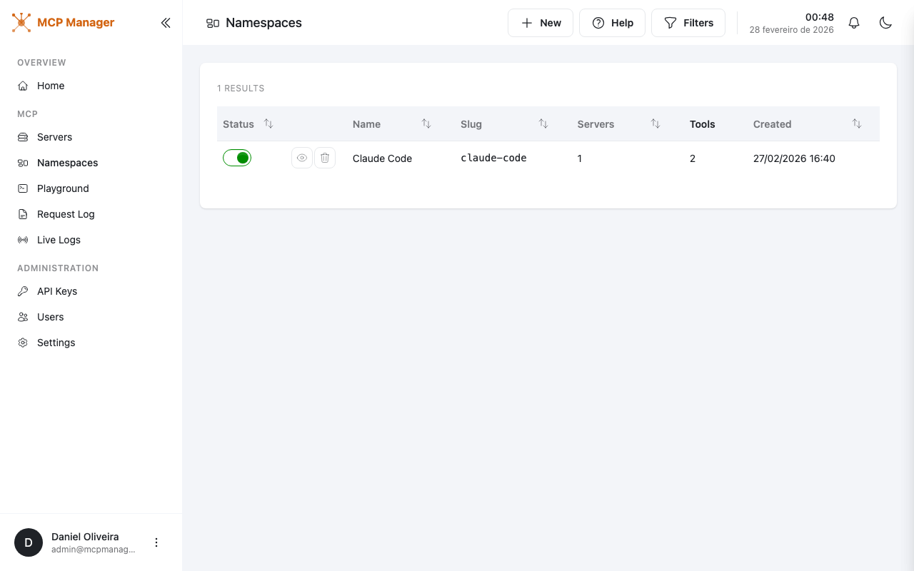
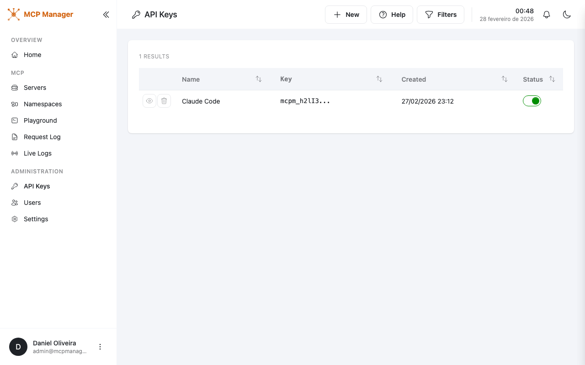
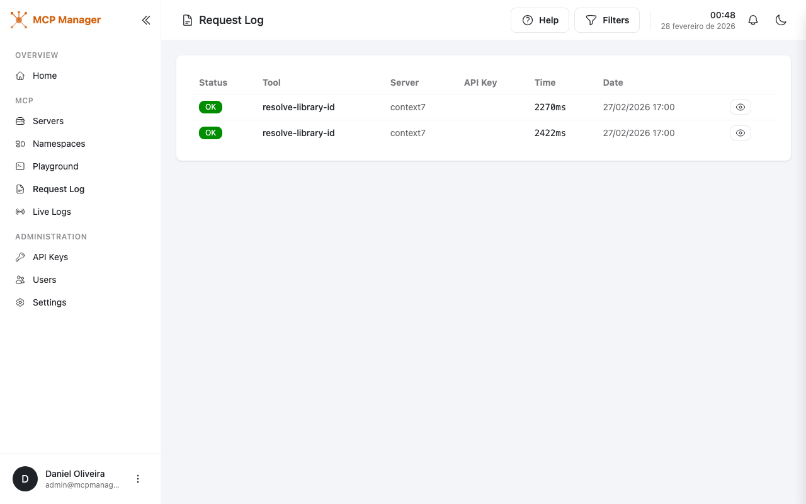
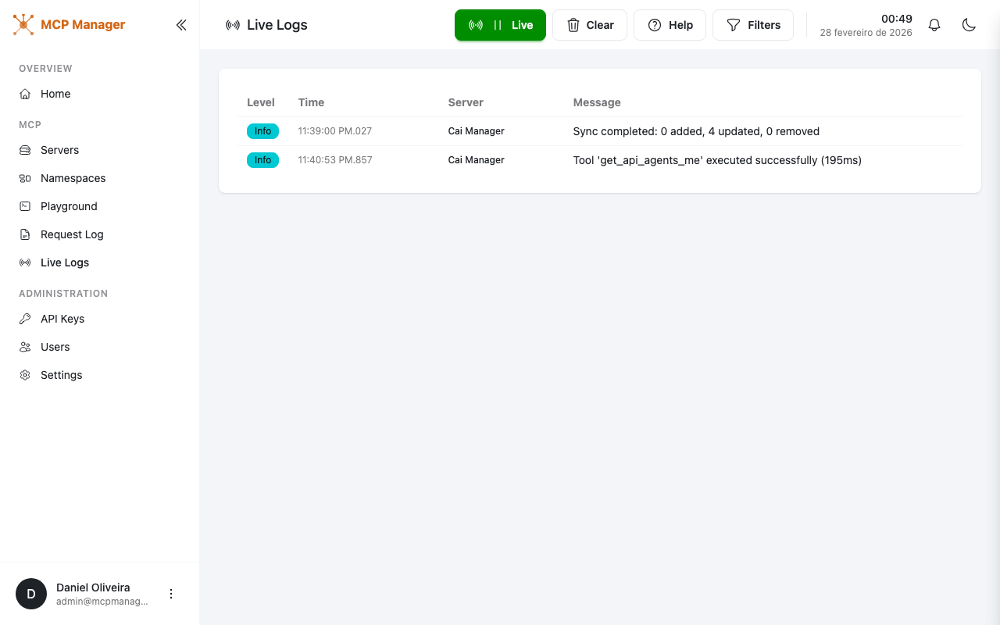
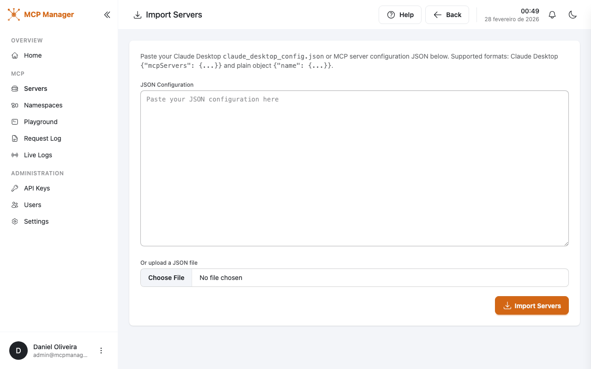
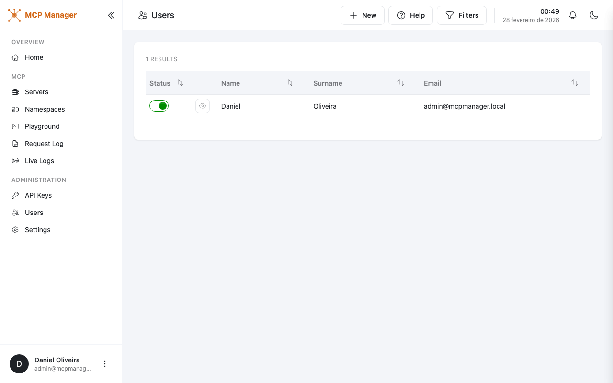

# MCP Manager

**A self-hosted MCP proxy and aggregation platform.**

Manage multiple upstream MCP (Model Context Protocol) servers, sync their tools, and expose them through a single unified MCP endpoint. Connect once, access everything.


---

## What is MCP Manager?

MCP Manager sits between your AI tools (Claude Code, Cursor, Windsurf, etc.) and your MCP servers. Instead of configuring each server individually in every client, you register them once in MCP Manager and connect your clients to a single endpoint.

```
┌─────────────┐     ┌──────────────┐     ┌─────────────────┐
│ Claude Code  │────▶│              │────▶│ MCP Server A    │
│ Cursor       │────▶│  MCP Manager │────▶│ MCP Server B    │
│ Windsurf     │────▶│   (proxy)    │────▶│ MCP Server C    │
│ ...          │────▶│              │────▶│ ...              │
└─────────────┘     └──────────────┘     └─────────────────┘
   AI Clients         Single Endpoint       Upstream Servers
```

## Key Features

- **Unified MCP Proxy** — Aggregate tools from multiple MCP servers into a single `/mcp` endpoint
- **Multi-Transport Support** — Connect to HTTP, Stdio, and OpenAPI-based servers
- **Namespace Organization** — Group tools into namespaces with independent rate limiting
- **Interactive Playground** — Test and execute MCP tools directly from the browser
- **API Key Management** — Scoped API keys with namespace-level access control
- **Import from Config** — Import servers from Cursor, Claude Desktop, or Opencode configurations
- **Request Logging** — Full audit trail of every MCP request
- **Live Log Streaming** — Real-time log viewer for debugging
- **User Management** — Multi-user support with role-based access
- **OpenAPI-to-MCP** — Automatically convert OpenAPI specs into MCP tools

## Screenshots

| | |
|---|---|
|  **Dashboard** — Overview of servers, tools, and API keys |  **Servers** — Manage upstream MCP servers |
|  **Create Server** — Add servers with multi-transport support |  **Playground** — Execute tools interactively |
|  **Namespaces** — Organize tools with rate limiting |  **API Keys** — Scoped key management |
|  **Request Log** — Audit trail |  **Live Logs** — Real-time streaming |
|  **Import** — Import from Claude Desktop / Cursor |  **Users** — User management |

## Getting Started

### Prerequisites

- [.NET 10 SDK](https://dotnet.microsoft.com/download)
- [Node.js](https://nodejs.org/) (for frontend build)

### Run Locally

```bash
# Clone the repository
git clone https://github.com/your-org/McpManager.git
cd McpManager

# Build the frontend
cd McpManager.Web.Portal && npm install && npx vite build && cd ..

# Run the application
dotnet run --project McpManager.Web.Portal
```

The app will be available at `http://localhost:5057`. A default admin account is created on first run.

### Docker

```bash
docker build -t mcpmanager .
docker run -p 5057:8080 -v mcpmanager-data:/app/data mcpmanager
```

The SQLite database and logs are stored in `/app/data`.

## Connecting Your AI Tools

Once MCP Manager is running, connect your AI tools to the unified endpoint:

```jsonc
// Example: Claude Code, Cursor, Windsurf, etc.
{
  "mcpServers": {
    "mcpmanager": {
      "url": "http://localhost:5057/mcp",
      "headers": {
        "Authorization": "Bearer YOUR_API_KEY"
      }
    }
  }
}
```

Generate API keys from the **API Keys** page in the admin panel.

## Configuration

### Transport Types

| Transport | Description | Auth Options |
|-----------|-------------|--------------|
| **HTTP** | Connect to remote MCP servers via HTTP/SSE | Bearer token, API key, Basic auth |
| **Stdio** | Run local MCP servers as CLI processes | Environment variables |
| **OpenAPI** | Auto-convert OpenAPI specs to MCP tools | Bearer token, API key, Basic auth |

### Environment Variables

| Variable | Description | Default |
|----------|-------------|---------|
| `ASPNETCORE_URLS` | Listening URLs | `http://+:8080` |
| `ConnectionStrings__DefaultConnection` | SQLite connection string | `data/mcpmanager.db` |

## Tech Stack

- **Backend**: .NET 10, ASP.NET Core, EF Core, SQLite
- **Frontend**: Tailwind CSS, DaisyUI, Vite, jQuery
- **MCP SDK**: ModelContextProtocol v0.6.0-preview.1
- **Auth**: ASP.NET Identity
- **Logging**: Serilog (console + rolling file)

## Project Structure

```
McpManager/
├── McpManager.Web.Portal/      # ASP.NET Core MVC app (entry point)
├── McpManager.Core.Mcp/        # MCP client/server management, tool sync
├── McpManager.Core.Identity/   # Authentication & authorization
├── McpManager.Core.Repositories/ # Data access layer
├── McpManager.Core.Data/       # EF Core context & entity models
└── Dockerfile
```

## License

MIT
