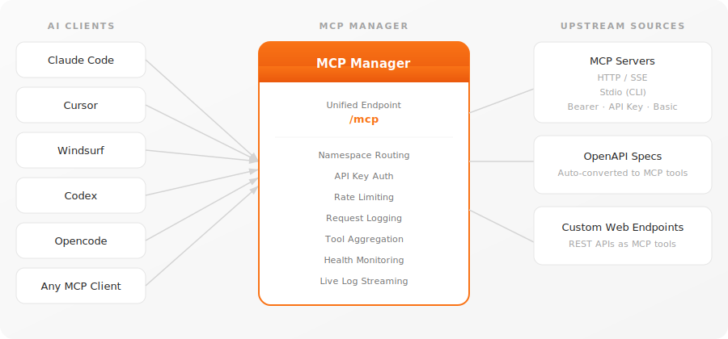
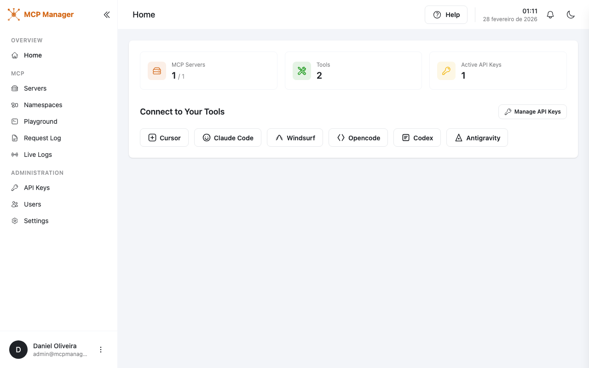
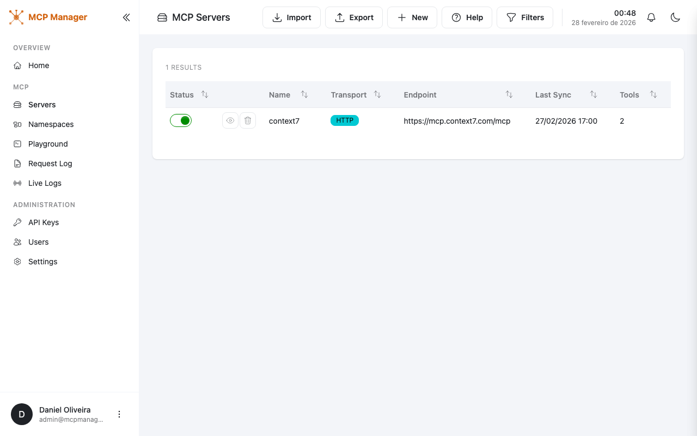
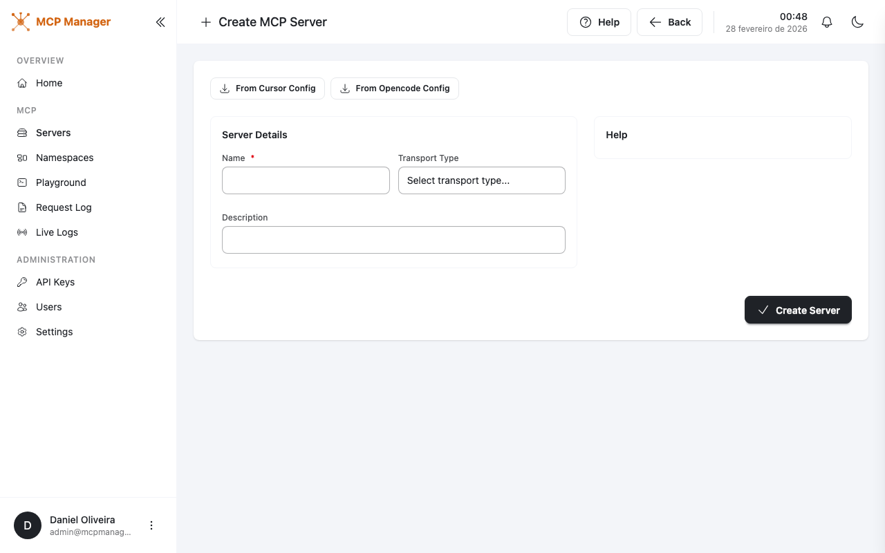
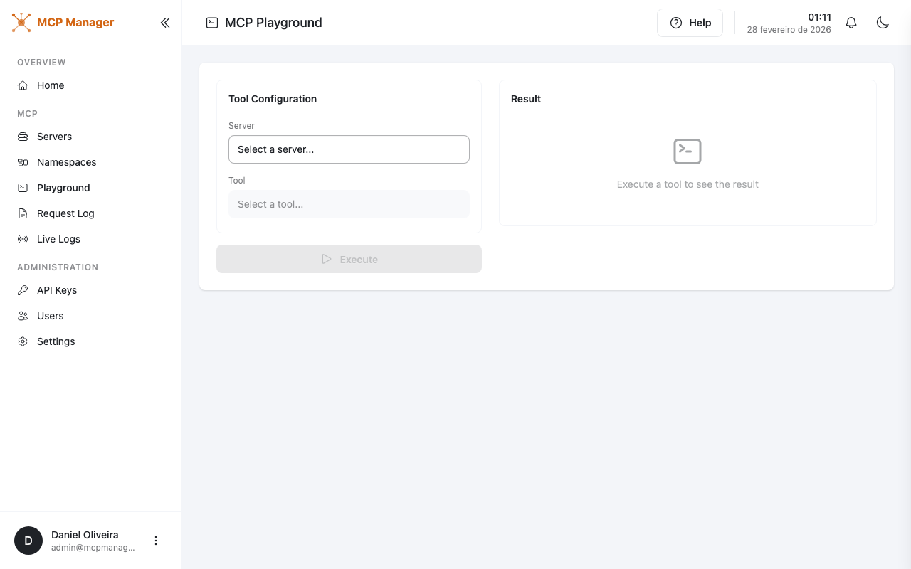

# MCP Manager

**A self-hosted MCP proxy and aggregation platform.**

Manage multiple upstream MCP (Model Context Protocol) servers, sync their tools, and expose them through a single unified MCP endpoint. Connect once, access everything.


---

## Quick Start

```bash
docker run -p 5057:8080 -v mcpmanager-data:/app/data ghcr.io/daniel3303/mcpmanager:latest
```

> Open [http://localhost:5057](http://localhost:5057) — a default admin account is created on first run.

---

## Table of Contents

- [Quick Start](#quick-start)
- [What is MCP Manager?](#what-is-mcp-manager)
- [Key Features](#key-features)
  - [Unified MCP Proxy](#unified-mcp-proxy)
  - [Multi-Transport Support](#multi-transport-support)
  - [Namespace Organization](#namespace-organization)
  - [Tool Customization & Control](#tool-customization--control)
  - [Health Checks & Notifications](#health-checks--notifications)
  - [Rate Limiting](#rate-limiting)
  - [Interactive Playground](#interactive-playground)
  - [API Key Management](#api-key-management)
  - [Import from Config](#import-from-config)
  - [OpenAPI-to-MCP](#openapi-to-mcp)
  - [Request Logging & Live Streaming](#request-logging--live-streaming)
  - [User Management](#user-management)
- [Screenshots](#screenshots)
- [Getting Started](#getting-started)
  - [Prerequisites](#prerequisites)
  - [Run Locally](#run-locally)
  - [Docker](#docker)
- [Connecting Your AI Tools](#connecting-your-ai-tools)
- [Configuration](#configuration)
  - [Transport Types](#transport-types)
  - [Environment Variables](#environment-variables)
- [Tech Stack](#tech-stack)
- [License](#license)

## What is MCP Manager?

MCP Manager sits between your AI tools (Claude Code, Cursor, Windsurf, etc.) and your MCP servers. Instead of configuring each server individually in every client, you register them once in MCP Manager and connect your clients to a single endpoint.

<p align="center">
  
</p>

## Key Features

### Unified MCP Proxy
Aggregate tools from all registered upstream MCP servers into a single `/mcp` endpoint. Connect your AI clients once and access every tool from every server — no per-server configuration needed.

### Multi-Transport Support
Connect to remote servers via HTTP/SSE, run local CLI tools via Stdio, or auto-convert REST APIs from OpenAPI specs. Each transport supports its own authentication methods (Bearer, API key, Basic auth, environment variables).

### Namespace Organization
Group MCP servers into logical namespaces with slug-based routing (e.g., `/mcp/namespaces/my-namespace`). Each namespace has independent rate limiting, API key scoping, and per-tool configuration.

### Tool Customization & Control
Override tool names, descriptions, and parameter schemas per server or per namespace. Enable or disable individual tools so the same server can expose different tool sets in different namespaces.

### Health Checks & Notifications
Automatic connectivity checks verify each server is reachable via its configured transport. When a server goes down, all active users receive in-app notifications.

### Rate Limiting
Per-namespace rate limiting with three strategies: PerApiKey (limit per unique key), PerIp (limit by client IP), or Global (single namespace-wide limit). Configure requests-per-minute thresholds independently for each namespace.

### Interactive Playground
Test and execute MCP tools directly from the browser. The playground dynamically builds input forms from each tool's JSON schema, including type-aware fields for enums, numbers, and nested objects.

### API Key Management
Generate scoped API keys (prefixed `mcpm_`) with optional namespace restrictions. Keys are used as Bearer tokens for authenticating MCP client connections and are tracked per-request for auditing.

### Import from Config
Import server configurations from Claude Desktop, Cursor, or Opencode JSON formats. Existing servers are detected and skipped automatically, with a summary of imported, skipped, and errored entries.

### OpenAPI-to-MCP
Point MCP Manager at any OpenAPI 3.x spec (JSON or YAML) and it automatically converts each operation into a callable MCP tool. Path, query, and body parameters are mapped to tool input schemas.

### Request Logging & Live Streaming
Every tool execution is recorded with parameters, response, success status, and execution time. A real-time log viewer streams entries with filters for server, log level, and time range.

### User Management
Multi-user support with ASP.NET Identity. Claims-based authorization controls access to features like server management, API keys, and the playground. Admins can create users, reset passwords, and manage permissions.

## Screenshots

| | |
|---|---|
|  **Dashboard** — Overview of servers, tools, and API keys |  **Servers** — Manage upstream MCP servers |
|  **Create Server** — Add servers with multi-transport support |  **Playground** — Execute tools interactively |

## Getting Started

### Prerequisites

- [.NET 10 SDK](https://dotnet.microsoft.com/download)
- [Node.js](https://nodejs.org/) (for frontend build)

### Run Locally

```bash
# Clone the repository
git clone https://github.com/daniel3303/McpManager.git
cd McpManager

# Build the frontend
cd McpManager.Web.Portal && npm install && npx vite build && cd ..

# Run the application
dotnet run --project McpManager.Web.Portal
```

The app will be available at `http://localhost:5057`. A default admin account is created on first run.

### Docker

```bash
docker run -p 5057:8080 -v mcpmanager-data:/app/data ghcr.io/daniel3303/mcpmanager:latest
```

The SQLite database and logs are stored in `/app/data`.

## Connecting Your AI Tools

Once MCP Manager is running, connect your AI tools to the unified endpoint:

```jsonc
// Example: Claude Code, Cursor, Windsurf, etc.
{
  "mcpServers": {
    "mcpmanager": {
      "url": "http://localhost:5057/mcp",
      "headers": {
        "Authorization": "Bearer YOUR_API_KEY"
      }
    }
  }
}
```

Generate API keys from the **API Keys** page in the admin panel.

## Configuration

### Transport Types

| Transport | Description | Auth Options |
|-----------|-------------|--------------|
| **HTTP** | Connect to remote MCP servers via HTTP/SSE | Bearer token, API key, Basic auth |
| **Stdio** | Run local MCP servers as CLI processes | Environment variables |
| **OpenAPI** | Auto-convert OpenAPI specs to MCP tools | Bearer token, API key, Basic auth |

### Environment Variables

| Variable | Description | Default |
|----------|-------------|---------|
| `ASPNETCORE_URLS` | Listening URLs | `http://+:8080` |
| `ConnectionStrings__DefaultConnection` | SQLite connection string | `data/mcpmanager.db` |

## Tech Stack

- **Backend**: .NET 10, ASP.NET Core, EF Core, SQLite
- **Frontend**: Tailwind CSS, DaisyUI, Vite, jQuery
- **MCP SDK**: ModelContextProtocol v0.6.0-preview.1
- **Auth**: ASP.NET Identity
- **Logging**: Serilog (console + rolling file)

## License

MIT
